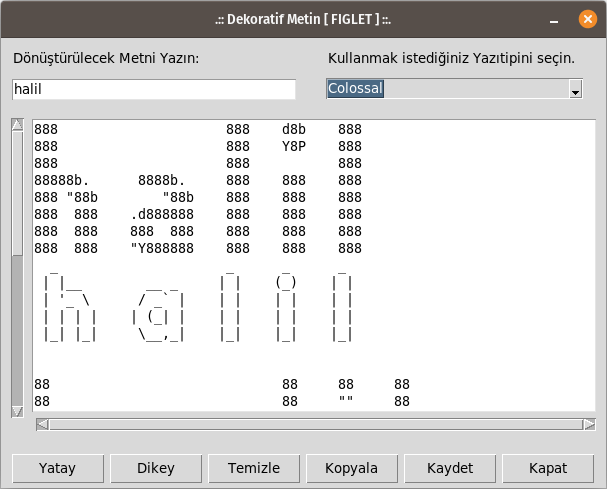
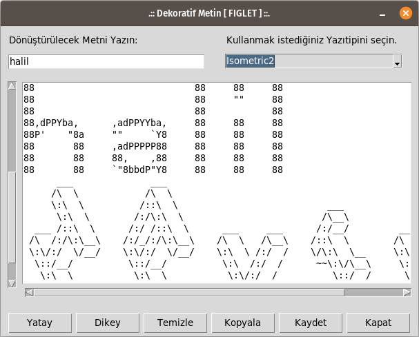
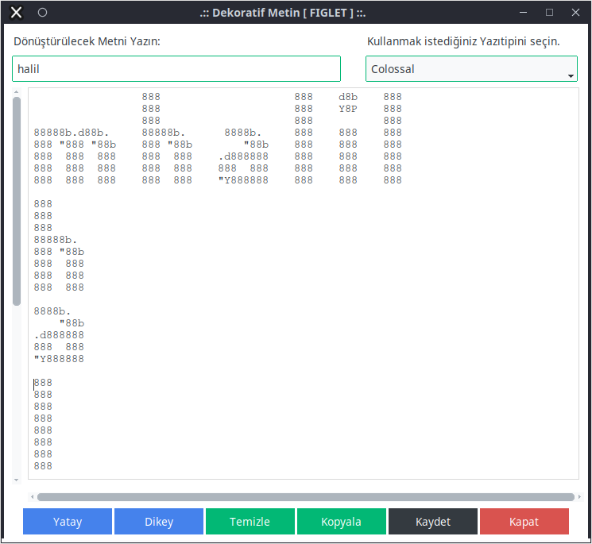
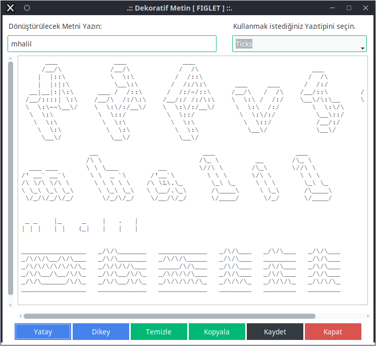
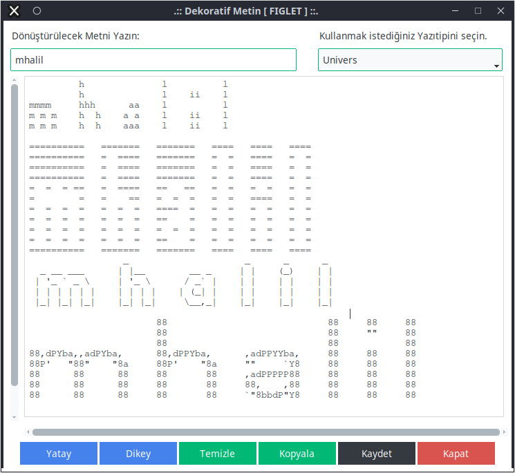
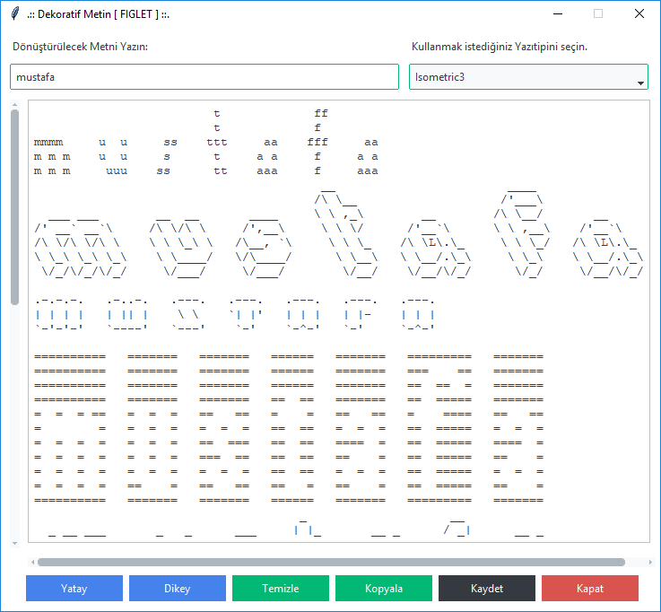
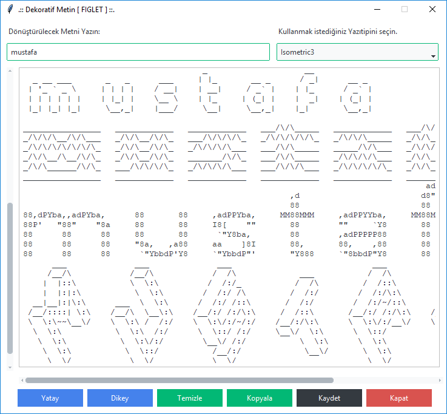

# DEKORATİF METİN

## v2 ve öncesi:
Kullanıcının yazdığı metni #, *, $, %, ...vb karakterlerle 9 satır yüksekliğinde metne çeviren python kodu.
http://www.figlet.org/ adresinde paylaşılan yazıtipi dosyalarını kullanarak benzer çıktılar üreten python kodu.

## v3:
**tkinter** kütüphanesi ile oluşturulan arabirim sayesinde, http://www.figlet.org/ adresinde paylaşılan yazıtipi dosyalarının bir kaçı kullanılarak dekoratif metin üreten python kodu.

## v4:
**ttkbootstrap** kütüphanesi ile oluşturulan arabirim.

## ÖRNEK ÇIKTILAR (KONSOL EKRANDA);

```
#   #    #    #        #    #      
#   #   # #   #             #      
#   #  #   #  #      #####  #      
#   #  #   #  #        #    #      
#####  #   #  #        #    #      
#   #  #####  #        #    #      
#   #  #   #  #        #    #      
#   #  #   #  #        #    #      
#   #  #   #  #####  #####  ##### 

X   X    X    X        X    X      
X   X   X X   X             X      
X   X  X   X  X      XXXXX  X      
X   X  X   X  X        X    X      
XXXXX  X   X  X        X    X      
X   X  XXXXX  X        X    X      
X   X  X   X  X        X    X      
X   X  X   X  X        X    X      
X   X  X   X  XXXXX  XXXXX  XXXXX
```

### FIGLET ÖRNEKLERİ:

```

      ___           ___                                             
     /__/\         /  /\                      ___                   
     \  \:\       /  /::\                    /  /\                  
      \__\:\     /  /:/\:\    ___     ___   /  /:/      ___     ___ 
  ___ /  /::\   /  /:/~/::\  /__/\   /  /\ /__/::\     /__/\   /  /\
 /__/\  /:/\:\ /__/:/ /:/\:\ \  \:\ /  /:/ \__\/\:\__  \  \:\ /  /:/
 \  \:\/:/__\/ \  \:\/:/__\/  \  \:\  /:/     \  \:\/\  \  \:\  /:/ 
  \  \::/       \  \::/        \  \:\/:/       \__\::/   \  \:\/:/  
   \  \:\        \  \:\         \  \::/        /__/:/     \  \::/   
    \  \:\        \  \:\         \__\/         \__\/       \__\/    
     \__\/         \__\/                                            

                 __                          ___                    ___         
                /\ \                        /\_ \         __       /\_ \        
  ___ ___       \ \ \___          __        \//\ \       /\_\      \//\ \       
/' __` __`\      \ \  _ `\      /'__`\        \ \ \      \/\ \       \ \ \      
/\ \/\ \/\ \      \ \ \ \ \    /\ \L\.\_       \_\ \_     \ \ \       \_\ \_    
\ \_\ \_\ \_\      \ \_\ \_\   \ \__/.\_\      /\____\     \ \_\      /\____\   
 \/_/\/_/\/_/       \/_/\/_/    \/__/\/_/      \/____/      \/_/      \/____/

                 _                     _      _      _    
  _ __ ___      | |__        __ _     | |    (_)    | |   
 | '_ ` _ \     | '_ \      / _` |    | |    | |    | |   
 | | | | | |    | | | |    | (_| |    | |    | |    | |   
 |_| |_| |_|    |_| |_|     \__,_|    |_|    |_|    |_|     
                                             
                                                                                                                  
                 888                     888    d8b    888    
                 888                     888    Y8P    888    
                 888                     888           888    
88888b.d88b.     88888b.      8888b.     888    888    888    
888 "888 "88b    888 "88b        "88b    888    888    888    
888  888  888    888  888    .d888888    888    888    888    
888  888  888    888  888    888  888    888    888    888    
888  888  888    888  888    "Y888888    888    888    888
                                                                                                                 
```
## UYGULAMA ARABİRİMİ

Kodlar, **tkinter** ve **ttkbootstrap** modulleri ile Görsel Arabirime kavuştu.
Uygulamayı görsel arabirim ile kullanmak mümkün.

### v3 ekran görüntüleri;



### v4 ekran görüntüleri (linux);




### v4 ekran görüntüleri (windows);



## MEVCUT FONKSİYONLAR

* Girilen Metni **YATAY** olarak Dekore Etmek
* Girilen Metni **DİKEY** olarak Dekore Etmek
* Girilen Metni ve Dekore Edilmiş Metni **TEMİZLEMEK**
* Dekore edilmiş Metni, Panoya **KOPYALAMAK**
* Dekore edilmiş Metni, Çalışma Dizinine **KAYDETMEK**
