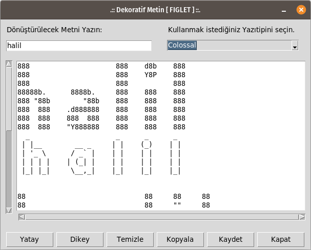
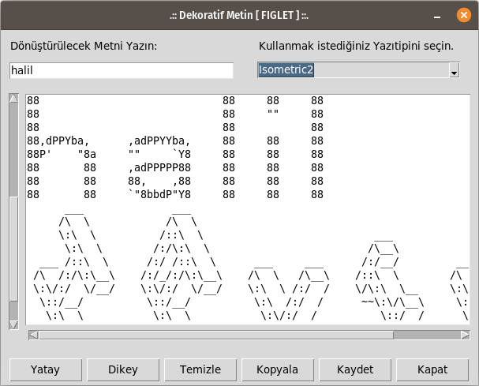
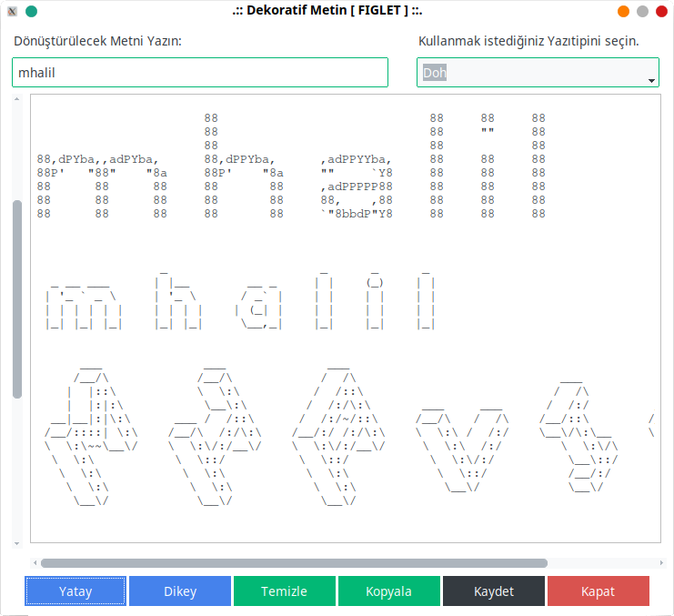
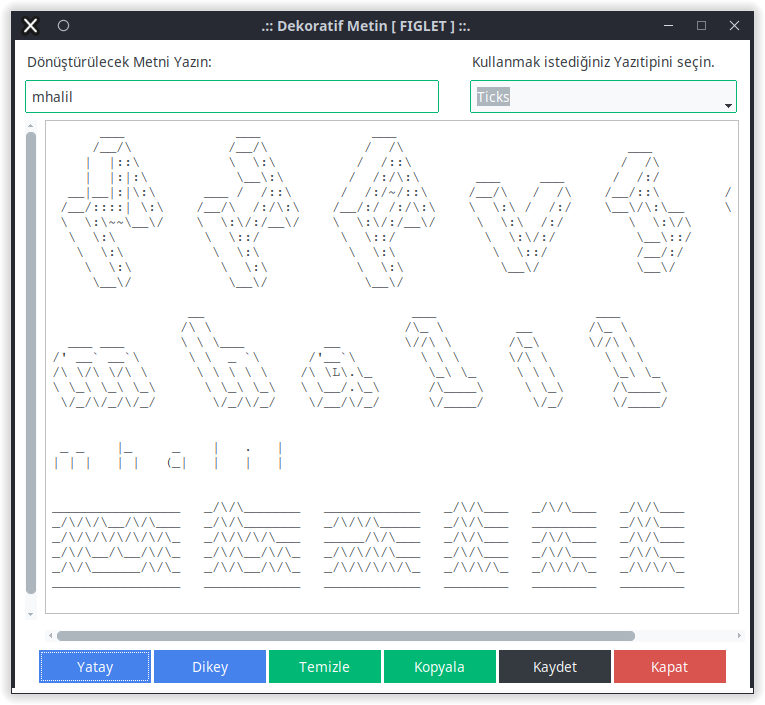

# DEKORATİF METİN

## v2 ve öncesi:
Kullanıcının yazdığı metni #, *, $, %, ...vb karakterlerle 9 satır yüksekliğinde metne çeviren python kodu.
http://www.figlet.org/ adresinde paylaşılan yazıtipi dosyalarını kullanarak benzer çıktılar üreten python kodu.

## v3:
**tkinter** kütüphanesi ile oluşturulan arabirim sayesinde, http://www.figlet.org/ adresinde paylaşılan yazıtipi dosyalarının bir kaçı kullanılarak dekoratif metin üreten python kodu.

## v4:
**ttkbootstrap** kütüphanesi ile oluşturulan arabirim.

## ÖRNEK ÇIKTILAR (KONSOL EKRANDA);

```
#   #    #    #        #    #      
#   #   # #   #             #      
#   #  #   #  #      #####  #      
#   #  #   #  #        #    #      
#####  #   #  #        #    #      
#   #  #####  #        #    #      
#   #  #   #  #        #    #      
#   #  #   #  #        #    #      
#   #  #   #  #####  #####  ##### 

X   X    X    X        X    X      
X   X   X X   X             X      
X   X  X   X  X      XXXXX  X      
X   X  X   X  X        X    X      
XXXXX  X   X  X        X    X      
X   X  XXXXX  X        X    X      
X   X  X   X  X        X    X      
X   X  X   X  X        X    X      
X   X  X   X  XXXXX  XXXXX  XXXXX


FIGLET ÖRNEKLERİ:

      ___           ___                                             
     /__/\         /  /\                      ___                   
     \  \:\       /  /::\                    /  /\                  
      \__\:\     /  /:/\:\    ___     ___   /  /:/      ___     ___ 
  ___ /  /::\   /  /:/~/::\  /__/\   /  /\ /__/::\     /__/\   /  /\
 /__/\  /:/\:\ /__/:/ /:/\:\ \  \:\ /  /:/ \__\/\:\__  \  \:\ /  /:/
 \  \:\/:/__\/ \  \:\/:/__\/  \  \:\  /:/     \  \:\/\  \  \:\  /:/ 
  \  \::/       \  \::/        \  \:\/:/       \__\::/   \  \:\/:/  
   \  \:\        \  \:\         \  \::/        /__/:/     \  \::/   
    \  \:\        \  \:\         \__\/         \__\/       \__\/    
     \__\/         \__\/                                            
     
          _______  _       _________ _       
|\     /|(  ___  )( \      \__   __/( \      
| )   ( || (   ) || (         ) (   | (      
| (___) || (___) || |         | |   | |      
|  ___  ||  ___  || |         | |   | |      
| (   ) || (   ) || |         | |   | |      
| )   ( || )   ( || (____/\___) (___| (____/\
|/     \||/     \|(_______/\_______/(_______/
                                             
                                                                                                                  
HHHHHHHHH     HHHHHHHHH               AAA               LLLLLLLLLLL             IIIIIIIIIILLLLLLLLLLL             
H:::::::H     H:::::::H              A:::A              L:::::::::L             I::::::::IL:::::::::L             
H:::::::H     H:::::::H             A:::::A             L:::::::::L             I::::::::IL:::::::::L             
HH::::::H     H::::::HH            A:::::::A            LL:::::::LL             II::::::IILL:::::::LL             
  H:::::H     H:::::H             A:::::::::A             L:::::L                 I::::I    L:::::L               
  H:::::H     H:::::H            A:::::A:::::A            L:::::L                 I::::I    L:::::L               
  H::::::HHHHH::::::H           A:::::A A:::::A           L:::::L                 I::::I    L:::::L               
  H:::::::::::::::::H          A:::::A   A:::::A          L:::::L                 I::::I    L:::::L               
  H:::::::::::::::::H         A:::::A     A:::::A         L:::::L                 I::::I    L:::::L               
  H::::::HHHHH::::::H        A:::::AAAAAAAAA:::::A        L:::::L                 I::::I    L:::::L               
  H:::::H     H:::::H       A:::::::::::::::::::::A       L:::::L                 I::::I    L:::::L               
  H:::::H     H:::::H      A:::::AAAAAAAAAAAAA:::::A      L:::::L         LLLLLL  I::::I    L:::::L         LLLLLL
HH::::::H     H::::::HH   A:::::A             A:::::A   LL:::::::LLLLLLLLL:::::LII::::::IILL:::::::LLLLLLLLL:::::L
H:::::::H     H:::::::H  A:::::A               A:::::A  L::::::::::::::::::::::LI::::::::IL::::::::::::::::::::::L
H:::::::H     H:::::::H A:::::A                 A:::::A L::::::::::::::::::::::LI::::::::IL::::::::::::::::::::::L
HHHHHHHHH     HHHHHHHHHAAAAAAA                   AAAAAAALLLLLLLLLLLLLLLLLLLLLLLLIIIIIIIIIILLLLLLLLLLLLLLLLLLLLLLLL
                                                                                                                 
```
## UYGULAMA ARABİRİMİ

Kodlar, **tkinter** modulü ile Görsel Arabirime kavuştu.
Uygulamayı görsel arabirim ile kullanmak mümkün.







## MEVCUT FONKSİYONLAR

* Girilen Metni **YATAY** olarak Dekore Etmek
* Girilen Metni **DİKEY** olarak Dekore Etmek
* Girilen Metni ve Dekore Edilmiş Metni **TEMİZLEMEK**
* Dekore edilmiş Metni, Panoya **KOPYALAMAK**
* Dekore edilmiş Metni, Çalışma Dizinine **KAYDETMEK**
